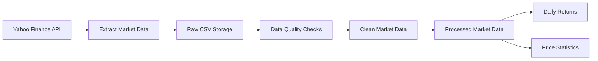

# 📊 Financial Market Data Platform

> A simple data engineering project that implements a local financial market data pipeline.

---

## 🧭 Overview

This project demonstrates a simplified **ETL pipeline** for financial market data.

It extracts historical stock data, validates and cleans it, and produces analytics-ready datasets.

---

## 🔄 Pipeline Flow



---

## ⚙️ What it does

- extracts historical market data using `yfinance`
- supports multiple stock symbols
- saves raw data to CSV
- runs basic data validation (missing values, duplicates, price logic)
- cleans and standardizes data
- builds simple analytics:
  - daily returns
  - price statistics (min / max / average / latest / volatility)

---

## 🏗 Architecture

```
Yahoo Finance API
→ Extract
→ Raw CSV Storage
→ Data Quality Checks
→ Data Cleaning
→ Processed Data
→ Data Marts
```

---

## 📁 Project Structure

```
financial-market-data-platform/
│
├── data/
│   ├── raw/
│   └── processed/
│
├── src/
│   ├── extract.py
│   ├── quality.py
│   ├── load.py
│   ├── transform.py
│   └── main.py
│
├── sql/
│   ├── create_tables.sql
│   └── analytics_queries.sql
│
├── .env.example
├── requirements.txt
└── README.md
```

---

## 📦 Data Outputs

| File | Description |
|------|------------|
| `data/raw/market_data.csv` | Raw extracted data |
| `data/processed/market_data.csv` | Cleaned dataset |
| `data/processed/daily_returns.csv` | Daily returns |
| `data/processed/price_statistics.csv` | Aggregated statistics |

---

## ▶️ How to Run

### 1. Create virtual environment
```bash
python -m venv .venv
source .venv/bin/activate
```

### 2. Install dependencies
```bash
pip install -r requirements.txt
```

### 3. Configure environment (optional)
```bash
cp .env.example .env
```

### 4. Run pipeline
```bash
python -m src.main
```

---

## 🗺 Roadmap

### ✅ Completed
- data extraction
- raw data storage
- data validation
- data cleaning
- data marts

### 🔜 Planned
- SQL integration improvements
- Airflow orchestration
- dbt transformations
